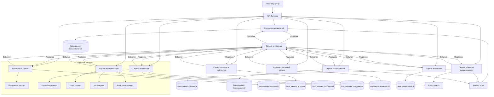

```mermaid
graph TD
    Client[Клиент/Браузер] --> Gateway[API Gateway]
    
    Gateway --> Auth[Сервис пользователей]
    Gateway --> Property[Сервис объектов недвижимости]
    Gateway --> Booking[Сервис бронирований]
    Gateway --> Payment[Платежный сервис]
    Gateway --> Reviews[Сервис отзывов и рейтингов]
    Gateway --> Communication[Сервис коммуникации]
    Gateway --> Geo[Сервис геолокации]
    Gateway --> Admin[Административный сервис]
    Gateway --> Analytics[Сервис аналитики]
    
    Auth -->|События| MessageBroker[Брокер сообщений]
    Property -->|События| MessageBroker
    Booking -->|События| MessageBroker
    Payment -->|События| MessageBroker
    Reviews -->|События| MessageBroker
    Communication -->|События| MessageBroker
    Geo -->|События| MessageBroker
    Admin -->|События| MessageBroker
    Analytics -->|События| MessageBroker
    
    MessageBroker -->|Подписка| Auth
    MessageBroker -->|Подписка| Property
    MessageBroker -->|Подписка| Booking
    MessageBroker -->|Подписка| Payment
    MessageBroker -->|Подписка| Reviews
    MessageBroker -->|Подписка| Communication
    MessageBroker -->|Подписка| Geo
    MessageBroker -->|Подписка| Admin
    MessageBroker -->|Подписка| Analytics
    
    Auth --> AuthDB[(База данных пользователей)]
    Property --> PropertyDB[(База данных объектов)]
    Booking --> BookingDB[(База данных бронирований)]
    Payment --> PaymentDB[(База данных платежей)]
    Reviews --> ReviewsDB[(База данных отзывов)]
    Communication --> CommunicationDB[(База данных сообщений)]
    Geo --> GeoDB[(База данных гео-данных)]
    Admin --> AdminDB[(Административная БД)]
    Analytics --> AnalyticsDB[(Аналитическая БД)]
    
    Property --> ElasticSearch[Elasticsearch]
    Geo --> ElasticSearch
    
    Auth --> Redis[Redis Cache]
    Property --> Redis
    Booking --> Redis
    
    subgraph "Внешние системы"
        Payment --> PaymentGateways[Платежные шлюзы]
        Geo --> MapProviders[Провайдеры карт]
        Communication --> EmailService[Email сервис]
        Communication --> SMSService[SMS сервис]
        Communication --> PushService[Push уведомления]
    end
``` 